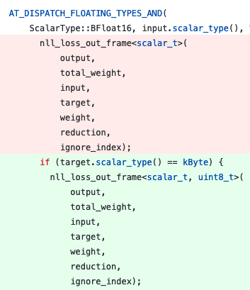
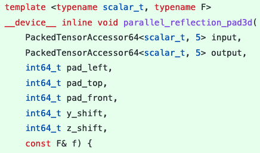
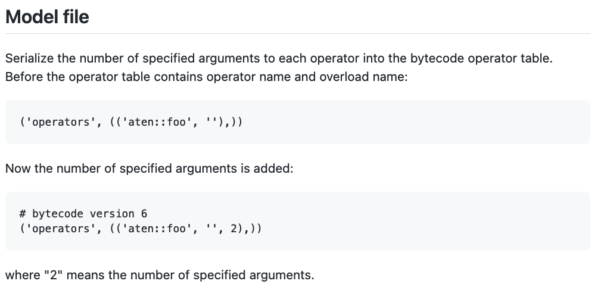
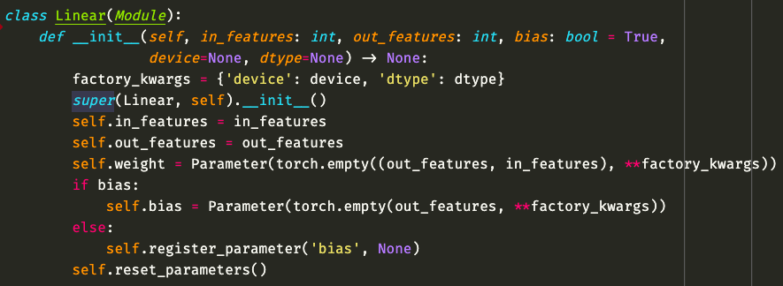
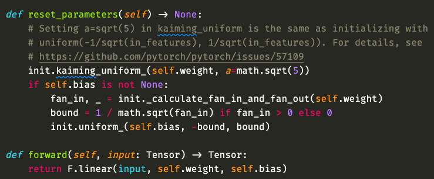
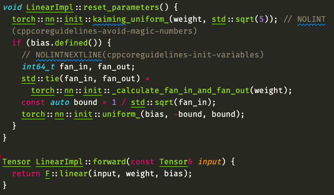
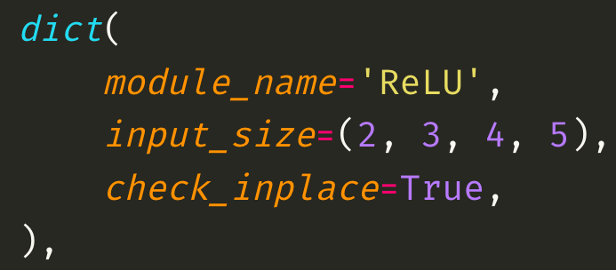

title: Tales of nn and ModuleInfo Development
use_katex: False
class: title-slide

# Tales of nn and ModuleInfo Development

.g.g-middle[
.g-6[

]
.g-6[

]
]

.larger[Thomas J. Fan] 

<a class="this-talk-link", href="https://github.com/thomasjpfan/quansight-2021-pytorch-nn-module" target="_blank">
This talk on Github: thomasjpfan/quansight-2021-pytorch-nn-module</a>

---

class: larger

# Contents
1. PRs without an issue!? 🎉
2. Tales with Compatibility Issues 🐛
3. FuncTorch + no-batch-dim 🔬
4. Designing ModuleInfo 👨‍🎨

---

# PRs without an issue!? 🎉

---

.g.g-middle[
.g-6[
# On CPU: #60308
]
.g-6[

]
]

---

# Tied to THC -> Aten migration

---

.g.g-middle[
.g-5[
# On CUDA: #60650
]
.g-7[

]
]

---

class: chapter-slide

# All ☀️ and 🌈s?

---

class: center, chapter-slide

# Tales with Compatibility Issues 🐛

---

---

## Structured Kernels

## Function template

---

---

---

class: center

---

---

class: larger

# What to look out for 🔭

1. Add a **new** operator
2. Update a **existing** Python function that uses the new operator
3. May cause compatibility issues with JIT-serialized models

---

class: larger

# Solution 💡

1. Add the **new** operator
2. **Do not** update Python function
3. In ~ 2 weeks hook up the operator in the Python function

---

---

---

---

# At the time, adding a default kwarg breaks jit serialized models. 🤯

---

---

---

---

# Now adding, a new default kwargs does not have compatibility issues!

---

---

# Add default kwargs at the end now works! ✅

---

# functorch
### JAX-like composable FUNCtion transforms for pyTORCH.
### https://github.com/facebookresearch/functorch

---

# no-batch-dim support for modules
## MaxPool2d

### Formalizing Style Guide for nn modules

---

---

class: chapter-slide

# Designing ModuleInfo 🔬

---

# What is a Module?
### Holds State

---

## Defines Computation

---

# C++ Module (`nn::Linear`)

---

class: larger

# Testing Modules Are Currently Tested

- `test/test_nn.py`
- `torch/testing/_internal/common_nn.py`
    - Defines databases of modules tests
    - **`module_tests`**
    - **`new_module_tests`**
    - **`criterion_tests`**

---

class: larger

# Designing ModuleInfo 🔬
- What to test for modules?
- What are the design constraints?

---

class: larger

# General idea 🔬

- **`ModuleInfo`** has a function that generate **`ModuleInput`**
- **`module_db: List[ModuleInfo]`**

---

# What to test? 🤔

- Can be pickled
- Can represented as a string (`__repr__`, `str`)
- `module.to(dtype).to(device)` works
- device transfers

---

# What to test? 🤔

- Forward pass is correct with a reference
- inplace modules
- gradcheck and gradgradcheck
- compare results between cpu + gpu
- noncontiguous data

---

class: larger

# Python + C++ parity checks

- `test/test_cpp_api_parity.py`
- Generates C++ code based on database in `common_nn.py`

---

# What are the design constraints? 🎨

1. Similar to OpsInfo
2. No samples are generated during test collection time
3. When possible, do things automatically

### Trade off between flexibility and complexity

---

# Inplace checks

---

# ModuleInfo check

---

class: larger

# ModuleInfo 💻
- `test/test_modules.py`
- `testing/_internal/common_modules.py`

---

class: larger

# Recap 🧢

- Adding a **new** operator and updating a **existing** Python function that uses the **new** operator, may have compatibility issues 🤯
- New kwargs with default values can be added to a operator without any issues 🎉
- ModuleInfo -> Win for test coverage 🚀
